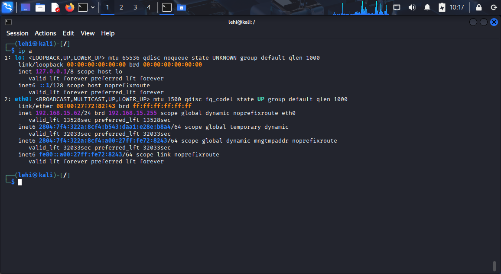
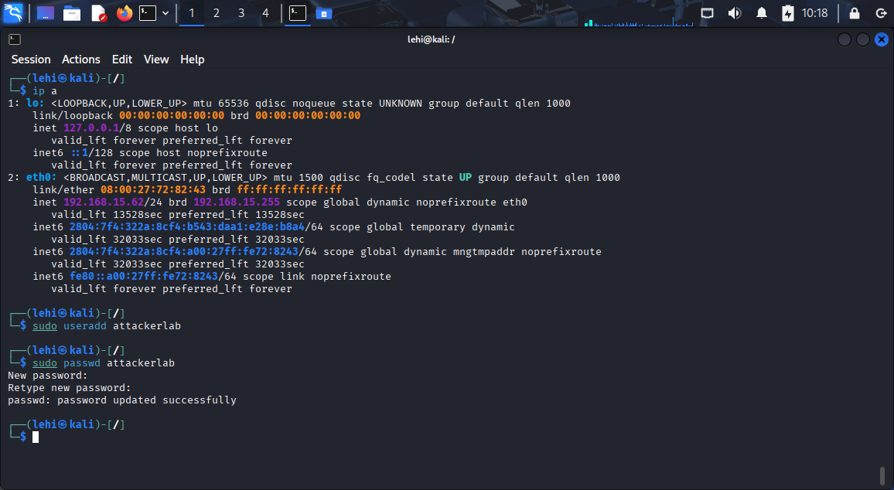
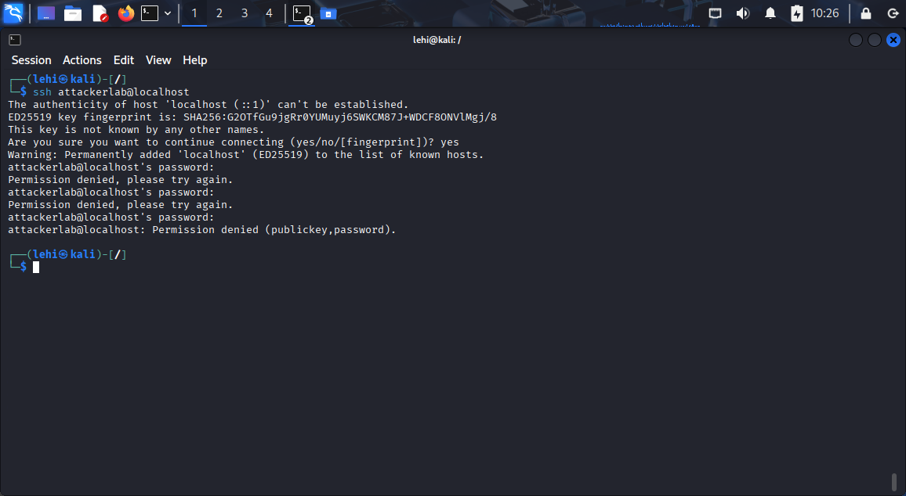
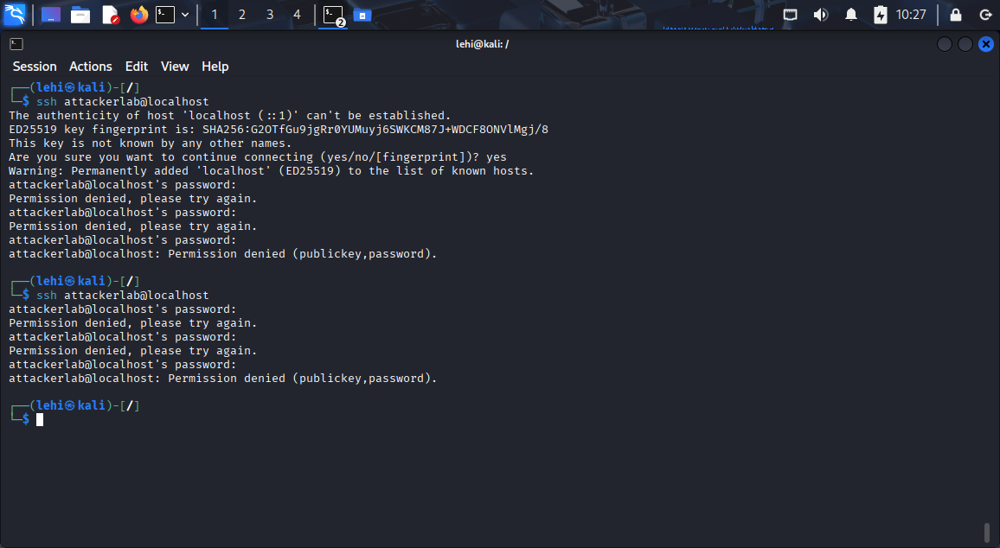
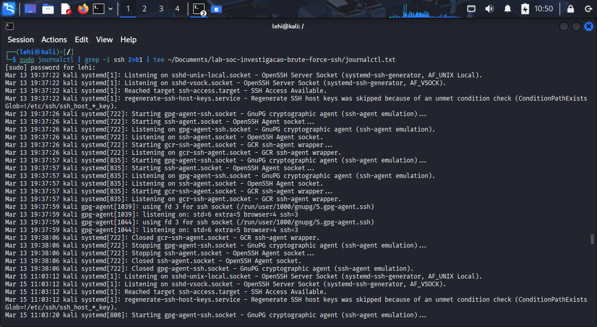

# 🔍 Investigação de tentativas de autenticação SSH falhas (Lab SOC/Blue Team – Kali Linux)

      

## 🎯 Objetivo

> Simular um cenário básico de brute force SSH em ambiente controlado e praticar a investigação em nível SOC/Blue Team, usando logs do sistema para identificar tentativas de autenticação anômalas, construir uma timeline e documentar o incidente em formato de relatório.

## 📂 Estrutura do repositório

A organização dos arquivos foi pensada para separar claramente documentação, evidências e artefatos gerados durante o laboratório.

```text
lab-soc-investigacao-brute-force-ssh/
├── README.md                 # Documentação principal do projeto
├── journalctl.txt	      # Saída filtrada do journalctl com as tentativas de login SSH.
├── images/                   # Evidências em formato de imagem
│   ├── brute-force-ip.png
│   ├── brute-force-useradd.png
│   ├── brute-force-passwd-1.png
│   ├── brute-force-passwd-2.png
│   ├── brute-force-journalctl.png
```

### 🧩 1. Resumo do incidente

- Data/hora (aprox.): 06/04/2026, entre 10:26:03 e 10:26:56.

- Alvo: serviço SSH em host Kali Linux (lab).

- Descrição: múltiplas tentativas de login falhas para o usuário ‘attackerlab’ a partir de localhost, simulando um cenário de brute force controlado.

- Classificação: simulação de incidente em ambiente de laboratório (não malicioso).

### 🌐 2. Escopo e ambiente

- Sistema operacional: Kali Linux (VM local).

- Serviço monitorado: SSH (sshd-session).

- Origem das tentativas: ::1 (localhost).



- Usuário alvo: attackerlab (criado exclusivamente para o lab).

### 🧭 3. Passos executados

- Criação do usuário de laboratório attackerlab em uma VM Kali Linux.



- Execução de múltiplas tentativas de autenticação SSH com senha incorreta para attackerlab a partir de localhost.





- Coleta de logs via journalctl relacionados ao serviço SSH.



- Análise das entradas de log para identificar padrão de brute force, origem e impacto.

### 📎 4. Evidências

- Entre 10:26:03 e 10:26:56 de 06/04/2026, foram registradas aproximadamente 6 tentativas de autenticação SSH com senha incorreta para o usuário ‘attackerlab’, originadas do endereço ::1 (localhost), conforme logs do serviço sshd-session. As entradas indicam múltiplas falhas de autenticação e encerramento da conexão após sucessivas tentativas sem sucesso.

- O arquivo de log completo está em [journalctl.txt](journalctl.txt).

### 🧠 5. Análise

- Volume e frequência: as tentativas ocorrem em uma janela muito curta (menos de um minuto), com falhas sucessivas de senha para o mesmo usuário, o que se assemelha a um padrão de brute force.

- Origem: o IP ::1 indica que as tentativas partiram do próprio host (localhost), não de um endereço externo.

- Impacto: não há evidência de autenticação bem-sucedida após as falhas, sugerindo que não houve comprometimento da conta.

- Contexto: trata-se de uma simulação controlada em ambiente de laboratório, não de atividade maliciosa em produção.

### 🏁 6. Conclusão e classificação

- Conclusão: o evento analisado representa um conjunto de tentativas de autenticação SSH falhas para o usuário ‘attackerlab’, sem sucesso de login, simulando um cenário de brute force local.

- Classificação: True Positive (tentativa de autenticação anômala) em ambiente de teste, com risco real nulo para ambiente produtivo.

- Status: incidente encerrado como simulação de lab, sem ação corretiva necessária.

### 🛡️ 7. Possíveis ações recomendadas

- Habilitar ou ajustar regras de bloqueio após múltiplas falhas de autenticação (ex.: fail2ban).

- Restringir acesso SSH apenas a IPs confiáveis.

- Monitorar continuamente falhas de login SSH e gerar alertas para padrões semelhantes.

### 🧠 8. O que aprendi

- A identificar, em logs do sistema (`journalctl`), eventos de autenticação SSH relacionados a tentativas de brute force, usando campos como usuário, origem, porta e timestamp.

- A construir uma **timeline básica de incidente**, agrupando múltiplas falhas de login em uma janela de tempo curta para caracterizar um comportamento anômalo.

- A pensar como um **SOC Analyst L1**, documentando o incidente em formato estruturado (resumo, escopo, evidências, análise, conclusão e ações recomendadas).

- A diferenciar um cenário de teste/ruído interno de um ataque real, considerando origem (`localhost`), ausência de login bem-sucedido e contexto de laboratório.

### 📚 9. Referências

- Documentação e artigos sobre análise de logs e autenticação SSH em Linux, com uso de `journalctl` para investigar eventos de segurança.

- Conteúdos sobre detecção de brute force em SSH e uso de regras/políticas para mitigar esse tipo de ataque em ambientes reais (ex.: bloqueio após múltiplas falhas).

- Guias e materiais sobre fluxo de triagem de alertas e investigação em SOC, incluindo construção de timeline, classificação (true/false positive) e registro de decisão.

#### ⚠️ Aviso importante

> Todas as atividades descritas neste laboratório foram executadas em ambiente controlado, utilizando uma máquina virtual Kali Linux de uso próprio, sem qualquer exposição a sistemas de terceiros ou infraestruturas de produção.

> Os testes de autenticação SSH e simulação de brute force tiveram finalidade exclusivamente educacional, com foco em desenvolvimento de habilidades de monitoramento, análise de logs e documentação de incidentes para atuação em SOC/Blue Team.
